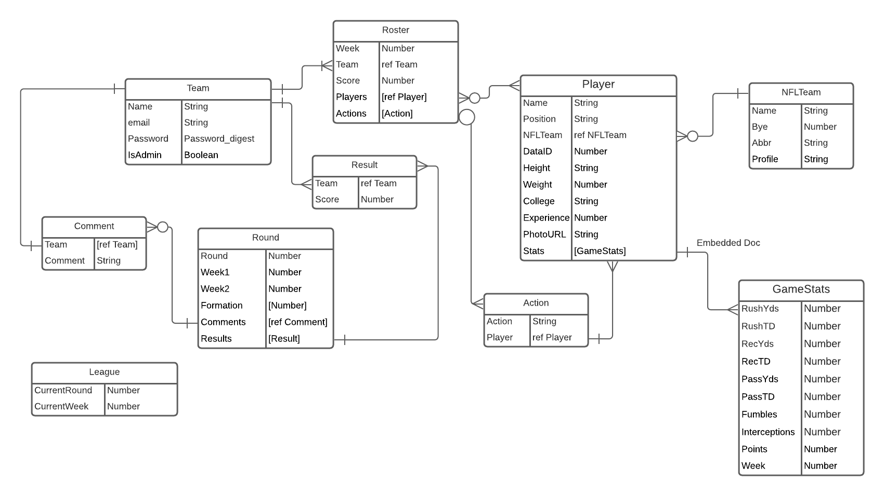

# G-League-FFL

## November 9, 2020

### By: Aaron Walker
[linkedIn](www.linkedin//in/walker-aaron)
***
### Overview

The G-League is a Fantasy Football League running in a Guillotine style - one team is eliminated after each two-week round - with a best-ball lineup system.  The rosters grow each week and the lineups in use grow each round.   The purpose of this application is to manage the rosters of all the teams in the league and score games and produce and display results.  The application will use the external [FantasyData](fantasydata.com) API as a source for scoring data and detailed player information.

***
### Technologies Used
* React
* Express
* Node
* HTML/CSS
* Javascript
* Mongoose
* MongoDB
***
Initial Entity Relationship Diagram

Initial Component Heirarchy Diagram

### User Stories - MVP
The user must be able to...
* view the current rosters for all teams
* view the results for each week
* review the rules and scoring system
* add players to a team's roster.
* drop players from a team's roster.
* alter the lineup definition as the rounds progress
* remove teams from competition as they are eliminated each round
* advance the week and round as appropriate
* make a copy of rosters when the week advances
* load the most recent results/statistics and score the week
* post comments about the results of each week
* view an individual player's weekly results
* see headshots and vital stats about players (height/weight/age/etc)
* restrict access to certain functions (loading scores, advancing week, etc) to the designated admin

***
### Future Updates / Backlog
* support authorization 
 
***
Project Tracking
Stories, backlog, and WIP managed at [Trello](https://trello.com/b/kJpCpP6C/g-league)

